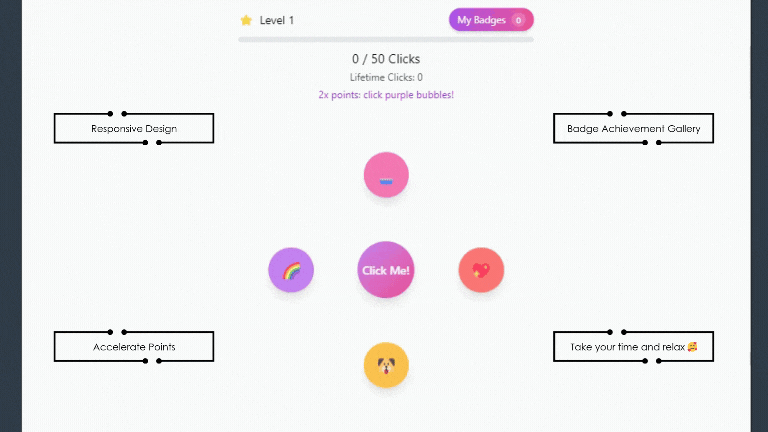

# 🎮 Mindfulness Clicker Game

[](https://reactjs.org/)
[](https://tailwindcss.com/)
[](https://www.framer.com/motion/)
[](https://opensource.org/licenses/MIT)

<p align="center">
  
</p>

> A delightful and engaging clicker game that combines mindfulness with fun gameplay mechanics! 🌈 ✨

## 🌟 Features

- **Progressive Difficulty**: Each level brings new challenges and rewards
- **Dynamic Interactions**: Engaging click mechanics with satisfying feedback
- **Orbital Motion**: Nodes start orbiting at Level 3 for added challenge
- **Point Multipliers**: Special challenges offer 2x and 3x point bonuses
- **Badge Collection**: Earn unique badges as you progress through levels
- **Responsive Design**: Perfect gameplay on any device
- **Local Progress**: Your game progress is automatically saved

## 🎯 How to Play

1. **Click the Bubbles**: Start by clicking the colorful bubbles around the center
2. **Watch for Challenges**: Special multiplier challenges appear randomly
3. **Collect Badges**: Level up to earn unique badges for your collection
4. **Master the Orbits**: From Level 3, bubbles start moving - time your clicks!

## 🚀 Getting Started

### Prerequisites

- Node.js (v14 or higher)
- npm or yarn

### Installation

```bash
# Clone the repository
git clone https://github.com/yourusername/game.clicker.git

# Navigate to project directory
cd game.clicker

# Install dependencies
npm install

# Start the development server
npm start
```

## 🛠️ Built With

- **React** - UI framework
- **Tailwind CSS** - Styling
- **Framer Motion** - Animations
- **use-sound** - Sound effects
- **canvas-confetti** - Celebration effects

## 🎮 Game Mechanics

### Levels
- **Level 1**: Basic clicking mechanics
- **Level 2**: Introduction of point multipliers
- **Level 3+**: Orbital motion mechanics

### Points System
- Base click: 1 point
- Yellow bubble challenge: 2x points
- Rainbow bubble challenge: 3x points
- Special combinations: Bonus points

### Badges
Collect unique badges as you progress:
- 🧁 Sweet Start
- 💖 Love Power
- 🐶 Playful Pup
- 🌈 Rainbow Joy
- ...and many more!

## 📱 Responsive Design

The game adapts beautifully to different screen sizes:
- 📱 Mobile-first approach
- 💻 Desktop-optimized layout
- 🎮 Touch-friendly controls
- 📺 Full-screen support

## 🎨 Color Scheme

Our carefully chosen color palette creates a delightful visual experience:
- 🟣 Purple primary accents
- 🎀 Pink gradients
- 🌈 Rainbow highlights
- ⚪ Clean white backgrounds

## 🤝 Contributing

Contributions are welcome! Feel free to:
1. Fork the repository
2. Create a feature branch
3. Commit your changes
4. Push to the branch
5. Open a Pull Request

## 📜 License

This project is licensed under the MIT License - see the [LICENSE](LICENSE) file for details.

## 🙏 Acknowledgments

- Inspired by mindfulness and meditation practices
- Sound effects from [OpenGameArt](https://opengameart.org)
- Icons and emojis from various open-source projects

---

<p align="center">Made with ❤️ and lots of ☕</p>

<p align="center">
  <a href="https://github.com/yourusername/game.clicker/issues">Report Bug</a> ·
  <a href="https://github.com/yourusername/game.clicker/issues">Request Feature</a>
</p>
